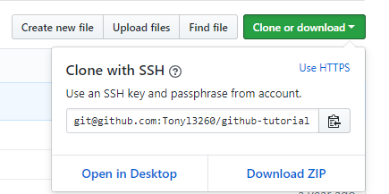

# GitHub Tutorial
#### _Tony Lin_
---
## Git vs. GitHub
Git is used for taking snapshots of your code (Add -> Commit) and it doesn't require Github. It a local
repository. On the other hand Github requires Git, and it stores (by pushing) the code into the "clouds",
website (c9). It is a remote repository.

---
## Initial Setup
`git init`- Initialize git in your directory allowing you to add code to the staging area and commit
them. Used when coder start a new Git project.
1. `cd ~/workspace/`(directory name)
2. `git init`
3. Use `ls -a` to check if git init has been initalize in the correct directory.

---
## Repository Setup
1. Go to Github.com, *create a Github account if you dont already have one.*
[Here is the link](https://github.com/)
2. Click on your avatar on the top right corner.
3. Click `your repository`
4. Press `New`
5. Give your repository a name
6. Then press create repository
7. Now go to your ide website (c9), *create an account if you dont have one.* 
[Here is the link](https://c9.io/signup)
8. Create a repository by clicking on the `+` icon on the top right corner.
9. Set up a SSH key or use a http link (*look below for guide*).
10. Now go to your repository and cd into workspace `cd ~/workspace`.
11. Git clone that repository using the SSH key or http link.
12. Now cd into that repository `cd (Name)` and then initalize `git init`
13. 

Every new local (c9) needs a remote (github) to push work into. You can use a SSH key to help push files  
into your repository or HTML. SSH is a one time setup that links your account with Github while HTTP
reqiures you to log into your Github account everytime you want to push.

How to setup your **SSH** key:
1. Go to your ide website (c9) 
2. Click on the gear icon on the top right corner.
2. Click **SSH keys**
3. Copy the SSH key on the top for public repository. Bottom SSH key for private repository.
4. Now go to Github
5. Press on your avatar on top right corner.
6. Click **SSH and GPG keys** [Link](https://github.com/settings/keys)
7. Now press `New SSH key`
8. Paste the SSH key from c9 and click `add SSH key`

How to use **HTTP**:
1. Go to your Github repository
2. Press `Clone or download`
3. Now you get your http link 

---
## Workflow & Commands
##### How to push your code to Github:
Edit -> Add -> Commit -> Push 
1. Edit your code and file. Make sure it is saved, ⌘s.
2. Before you can add your code to the staging area, the directory must be intialized `git init`. To
add the code to the staging area you can use `git add .` or `git add filename`. You can check to see
if your code has to been added to the staging area by using `git status`.
3. To commit your file, your file must be first add to the statging area. You can commit your file
by using `git commit -m "msg"`. You can put a message when you commit to remind you what you just
committed.
4. To push your file the requirement above must be first fulfilled and a git remote to connect to your
your local (c9). You can check to see what remote is connected to our directory by using `git remote -v`.
You can push your code by using `git push origin master`. However if you flag your remote the first time
by using `-u``git push -u origin master` you dont have to type `git push origin master` everytime you 
want to push. Instead you can use `git push`.

---
## Rolling Back Changes
git checkout -- FILENAME: Reset all changes made that are currently not staged (have'nt been `git add`).

git reset HEAD FILENAME: Removes a file from the staging area.

`number`- amount of commits to go back. Changing the number changes the amount of time you undo something.

git reset --soft HEAD~1: Undo the previous commit, keeping the files in the stating area and the changes
made previously.

git reset HEAD~1: Undo the previous commit, but **Remove** the files from the staging area while keeping 
the changes made previously.

git reset --hard HEAD~1: Undo the previous commit, but **Removes** both the file from the staging are and 
the changes made.

git reset --hard SHA: Undo to previous commit with the SHA from the beginning, all changes made after the
commit will be lost.
